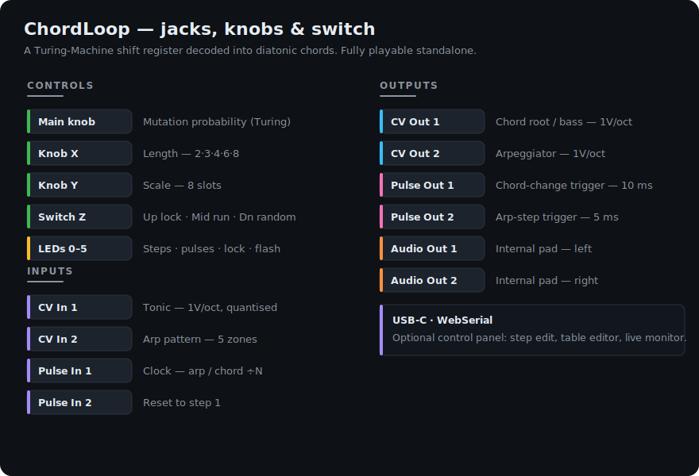
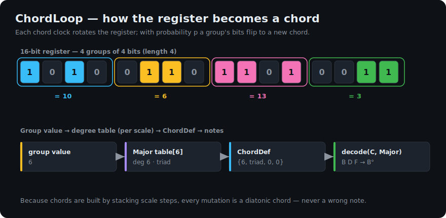
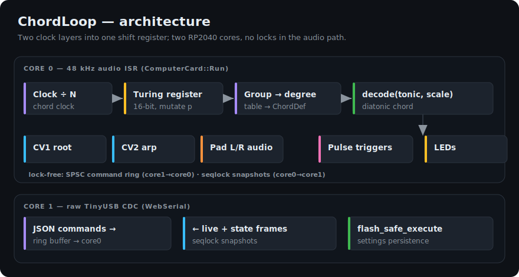

# ChordLoop

A random **looping chord-progression generator** for the [Music Thing Modular
Workshop System Computer](https://www.musicthing.co.uk/workshopsystem/) (RP2040
program card), built on Chris Johnson's header-only
[ComputerCard](https://github.com/TomWhitwell/Workshop_Computer) library.

ChordLoop keeps the classic **Turing Machine** mechanism — a 16-bit shift
register with a probability knob that flips bits as it rotates — but decodes the
register into **scale degrees** instead of raw voltages. Groups of bits index a
degree table for the selected scale, so every mutation picks a different
*diatonic* chord: the loop evolves endlessly, but never plays a wrong note.

<p align="center"></p>

- **Standalone**: knobs + switch + clock is all you need.
- **Two clock layers**: an *arp clock* (every pulse) walks the current chord's
  tones; a *chord clock* (every ÷N pulses) advances the progression.
- **Chord + arp CV outputs** (1V/oct), **trigger outputs**, and an **internal
  stereo pad voice** on the audio outs.
- Optional **WebSerial control panel** for step editing, degree-table
  customisation and live monitoring — live at
  **https://heim.github.io/workshop-computer-chord-loop/**
- Settings persist to card flash.

---

## How it works

Each incoming clock pulse steps the arpeggiator through the current chord. Every
*N*th pulse (the chord clock, default ÷8) advances the progression: the register
rotates, and with a probability set by the **Main knob** the bits of the current
group are flipped — the "Turing" mutation. The new group value indexes the
degree table for the active scale, producing a chord.

<p align="center"></p>

Because chords are built by **stacking scale steps** (diatonic thirds) on top of
a root degree, every tone is itself a scale degree — so any register value, for
any tonic, yields an in-scale chord. This is verified by the unit tests across
all default tables, all 8 scales and all 12 tonics.

The **Main knob** is a triangular probability curve, Turing-Machine style:

| Main knob | Behaviour |
|-----------|-----------|
| Fully CW  | `p = 0` — locked loop (repeats exactly) |
| Noon      | `p = 1` — constant variation (every step mutates) |
| Fully CCW | `p = 0` — locked loop |

The card runs entirely on the RP2040's two cores, with no locks in the audio
path: the 48 kHz audio ISR owns core 0, while the USB/WebSerial stack lives on
core 1 and exchanges data through a lock-free command ring and seqlock
snapshots.

<p align="center"></p>

---

## Panel mapping

| Control / Jack | Function |
|----------------|----------|
| **Main knob**  | Mutation probability. CW = locked, noon = maximum chaos, CCW = locked (see curve above). |
| **Knob X**     | Progression length: **2, 3, 4, 6, 8** steps. (2–4 use rich 16-entry tables; 6 & 8 use curated 4-entry tables.) |
| **Knob Y**     | Scale: Major · Natural minor · Harmonic minor · Dorian · Phrygian · Mixolydian · Lydian · Minor pentatonic. |
| **Switch Z**   | **Up** = hard lock (freezes the loop). **Middle** = run. **Down** (momentary) = re-randomise the whole register. |
| **CV In 1**    | Tonic, 1V/oct. Quantised to the nearest semitone with hysteresis; sampled on chord-clock boundaries. Unpatched = base tonic (C3). |
| **CV In 2**    | Arp pattern select, 5 zones across the range: Up · Down · Up-Down · Random · Strum. Unpatched = Up. |
| **Pulse In 1** | Clock. Every pulse = one arp step; every ÷N pulses = one chord step. |
| **Pulse In 2** | Reset the progression to step 1 (does not clear the register). |
| **CV Out 1**   | Chord root / bass note, 1V/oct (calibrated `CVOutMIDINote`). |
| **CV Out 2**   | Arpeggiator, 1V/oct. |
| **Pulse Out 1**| 10 ms trigger on every chord change. |
| **Pulse Out 2**| 5 ms trigger on every arp step. |
| **Audio Out 1/2** | Internal stereo pad voice (one oscillator per chord tone, detuned, panned, low-passed, crossfaded on chord changes). |
| **LEDs**       | Left column (0/2/4) = 3-bit binary step counter. LED 1 = chord-change pulse, LED 3 = arp-step pulse, LED 5 = hard-lock indicator. All six flash for 50 ms whenever a mutation actually flips bits ("Turing struck"). No clock for 3 s → slow "waiting" chase. |

---

## Patch examples

**1 · Melodic sequence (standalone).**
Clock → **Pulse In 1**. **CV Out 1** → a VCO's 1V/oct; **Pulse Out 1** → an
envelope. Turn **Main** toward noon and the chord roots evolve; turn it fully CW
to lock a loop you like. **Knob Y** changes the mood (try Dorian or Lydian).

**2 · Chord + arpeggio.**
As above, plus **CV Out 2** → a second VCO and **Pulse Out 2** → its envelope
for an arpeggiated line over the root. Patch an offset/CV into **CV In 2** to
sweep the arp pattern from Up through to Strum.

**3 · Instant pad.**
Nothing but a clock: take **Audio Out 1 & 2** straight to your mixer for a
crossfaded stereo chord pad. Adjust the pad voice (waveform / detune / cutoff /
width) from the web panel.

**4 · Key/tonic control.**
A keyboard or sequencer's 1V/oct → **CV In 1** transposes the whole progression;
the tonic only updates on chord boundaries, so it never glitches mid-chord.

**5 · Clocking from MIDI Thing V2.**
Patch a clock output to **Pulse In 1**. Because the arp steps on *every* pulse,
pick a clock resolution that suits the musical result:

- **4 PPQN (16th notes)** is the sweet spot: the arp runs in 16ths; set the
  chord clock to **÷16** for a new chord every bar, or **÷8** for every half-bar.
- **24 PPQN** (MIDI Thing V2's default clock) makes the arp a fast 24-per-beat
  flurry — great for shimmering textures; use **÷16** for chords roughly twice a
  bar, or lower the MIDI Thing's clock division for beat-aligned changes.

Set the chord clock division on the web panel (1 / 2 / 4 / 8 / 16).

---

## Web control panel (optional)

A static single-page app (`web/index.html`) talks to the card over the
[Web Serial API](https://developer.mozilla.org/en-US/docs/Web/API/Web_Serial_API).
It requires a **Chromium** desktop browser (Chrome / Edge / Opera) over `https://`
(the hosted page) or `file://`. Firefox and Safari don't support Web Serial; the
card is unaffected — the panel is entirely optional.

Use the hosted version at
**https://heim.github.io/workshop-computer-chord-loop/**, or open `web/index.html`
locally. Click **Connect** and pick the ChordLoop serial port.

- **Progression** — live strip of chord names, current step highlighted, cells
  flash on mutation. Each cell's menu picks a chord from the active degree table
  (writes the bits back to the register); 🔒 locks a step so the Turing mutation
  never touches it.
- **Degree table editor** — per scale, per group size, edit each slot's degree /
  chord type / inversion / octave. Presets (Pop / Sad / Jazz-ish / Modal drone)
  and "Restore defaults".
- **Config & monitor** — chord clock division, arp pattern override, pad-voice
  parameters; live tonic (as a note name), clock estimate, and the raw register
  bits. **Save** writes everything to flash (survives power-cycles).

Knobs on the module and controls on the page both drive the card — last change
wins, so moving a physical knob always takes over.

---

## Build & flash

### Prebuilt UF2

Grab the latest `chordloop-*.uf2` from the
[Releases](https://github.com/heim/workshop-computer-chord-loop/releases) page,
then write it to a card:

1. Download the `.uf2`.
2. Pull off the **main knob** at the top of Computer to reveal the recessed
   **top (BOOTSEL) button**.
3. Insert the target card into the program-card slot (any card — printed cards
   are not write-protected).
4. Connect **USB-C** from Computer's front panel and **power-cycle** the
   Workshop System so it connects.
5. Hold the **top button**, tap and release the **bottom button** by the card
   slot, then let go. The **`RPI-RP2`** drive appears.
6. Drag the `.uf2` onto `RPI-RP2`. It reboots running ChordLoop.

### Building from source

Requires the [Pico SDK](https://github.com/raspberrypi/pico-sdk) (2.3.0 is
pinned in CI) with the TinyUSB submodule, and the ARM GCC toolchain.

```bash
export PICO_SDK_PATH=/path/to/pico-sdk   # with lib/tinyusb checked out
cmake -S firmware -B firmware/build -DCMAKE_BUILD_TYPE=Release
cmake --build firmware/build --parallel
# -> firmware/build/chordloop.uf2
```

On Ubuntu the toolchain is:

```bash
sudo apt-get install -y cmake gcc-arm-none-eabi \
  libnewlib-arm-none-eabi libstdc++-arm-none-eabi-newlib \
  build-essential libusb-1.0-0-dev pkg-config
```

### Tests

The musical engine, arpeggiator, tonic quantiser, persistence and serial
protocol are pure logic and unit-tested natively (no hardware, no SDK):

```bash
./test/run_tests.sh
```

---

## Repository layout

```
firmware/   main.cpp + engine/arp/pad/serial/persist modules, ComputerCard.h,
            tusb_config.h, usb_descriptors.c, CMakeLists.txt
web/        index.html  (self-contained WebSerial control panel)
docs/       *.svg diagrams
test/       host-side unit tests
.github/workflows/  build.yml (CI) · pages.yml (deploy panel) · release.yml
```

The engine (`chord_engine`, `music_tables`), `arp`, `pad_voice`, `serial_proto`
and the serialisation half of `persist` are free of SDK includes so they compile
and are tested on the host. All musical constants live in `music_tables.*` for
easy tweaking.

---

## Notes & v1 deviations

- **Tonic CV scaling** (`kCvCountsPerVolt` in `settings.h`) is a nominal value
  for the *uncalibrated* CV input (~341 counts/V ≈ ±6 V). The quantiser snaps to
  the nearest semitone, which absorbs small errors; tweak the constant if bench
  measurement shows a different slope.
- **"Double-length" CCW mode** from the original Turing Machine is not
  implemented in v1: both knob extremes are simply locked (symmetric triangular
  probability). The `doubleLen_` flag is tracked for a future revision.
- **Flash persistence** uses the SDK's `flash_safe_execute` (parks the audio
  core for the brief erase/program). The serialisation + CRC are unit-tested;
  the flash I/O itself is exercised on hardware.
- Not in v1 (planned): scale auto-detection from incoming pitch CV, MIDI.

---

## Credits & licence

- [ComputerCard](https://github.com/TomWhitwell/Workshop_Computer) by Chris
  Johnson (MIT), vendored in `firmware/ComputerCard.h`.
- USB descriptor scaffolding derived from the TinyUSB CDC example (MIT).

Released under the MIT License — see [LICENSE](LICENSE).
